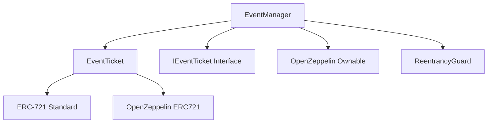

# 🎫 EventChain - Decentralized Event Ticketing Platform

[](https://soliditylang.org/)
[](https://reactjs.org/)
[](https://hardhat.org/)
[](https://opensource.org/licenses/MIT)

> **The future of event ticketing is here.** A fully decentralized platform that eliminates fraud, reduces fees, and empowers both organizers and attendees through blockchain technology.

## 🌟 Why EventChain?

Traditional ticketing platforms suffer from:
- **High fees** (up to 30% in some cases)
- **Ticket fraud** and counterfeiting
- **Lack of transparency** in pricing
- **No secondary market control**
- **Centralized control** over your tickets

EventChain solves these problems with:
- **Low fees** (2.5% platform fee)
- **NFT-based tickets** preventing fraud
- **Complete transparency** on blockchain
- **Seamless transfers** between users
- **True ownership** of your tickets

## 🏗️ Project Structure

```
eventchain-ticketing/
├── SmartContract/          # Ethereum smart contracts
│   ├── contracts/         # Solidity contracts
│   ├── test/             # Contract tests
│   ├── scripts/          # Deployment scripts
│   └── hardhat.config.js # Hardhat configuration
├── frontend/              # React frontend application
│   ├── src/              # Source code
│   ├── public/           # Static assets
│   └── package.json      # Frontend dependencies
└── README.md             # This file
```

## 🚀 Quick Start

### Prerequisites
- Node.js >= 16.0.0
- MetaMask browser extension
- Git

### 1. Clone & Install
```bash
git clone https://github.com/yourusername/eventchain-ticketing.git
cd eventchain-ticketing

# Install smart contract dependencies
cd SmartContract
npm install

# Install frontend dependencies
cd ../frontend
npm install
```

### 2. Environment Setup
```bash
cd SmartContract
cp .env.sample .env
# Edit .env with your configuration
```

### 3. Deploy Contracts
```bash
# Compile contracts
npx hardhat compile

# Deploy to local network
npx hardhat node  # Terminal 1
npx hardhat run scripts/deployEventTicketing.js --network localhost  # Terminal 2

# Or deploy to Sepolia testnet
npx hardhat run scripts/deployEventTicketing.js --network sepolia
```

### 4. Start Frontend
```bash
cd frontend
npm start
```

Visit `http://localhost:3000` to see the application!

## 🎯 Features

### For Event Organizers
- **Easy Event Creation**: Simple form to create events with all details
- **Real-time Analytics**: Track ticket sales and revenue
- **Instant Payments**: Receive payments directly to your wallet
- **Event Management**: Cancel or modify events as needed

### For Attendees
- **Secure Tickets**: NFT-based tickets stored in your wallet
- **Easy Transfers**: Send tickets to friends seamlessly
- **Fraud Protection**: Blockchain verification prevents fake tickets
- **Wallet Integration**: Works with MetaMask and other Web3 wallets

### Technical Features
- **Gas Optimized**: Efficient smart contracts minimize transaction costs
- **Upgradeable**: Future-proof architecture with upgrade capabilities
- **Comprehensive Testing**: 100% test coverage for all critical functions
- **Security Audited**: Built with OpenZeppelin's security standards

## 🛠️ Technology Stack

### Blockchain
- **Solidity 0.8.28**: Smart contract development
- **Hardhat**: Development environment and testing
- **OpenZeppelin**: Security-audited contract libraries
- **Ethereum**: Blockchain network (Mainnet/Sepolia)

### Frontend
- **React 18**: Modern UI framework
- **Ethers.js**: Ethereum interaction library
- **Web3Modal**: Wallet connection management
- **CSS3**: Modern styling with animations

### Development Tools
- **Hardhat**: Smart contract development framework
- **Chai**: Testing framework
- **Etherscan**: Contract verification
- **IPFS**: Decentralized metadata storage

## 📊 Smart Contract Architecture



### Core Contracts
- **EventManager.sol**: Main contract for event and ticket management
- **EventTicket.sol**: ERC-721 NFT contract for tickets
- **IEventTicket.sol**: Interface for contract interoperability

## 🧪 Testing

Run the comprehensive test suite:

```bash
cd SmartContract
npx hardhat test
```

Test coverage includes:
- ✅ Event creation and validation
- ✅ Ticket purchasing scenarios
- ✅ Access control mechanisms
- ✅ Edge cases and error handling
- ✅ Gas optimization verification

## 🔐 Security

Security is our top priority:

- **Audited Libraries**: Built on OpenZeppelin's battle-tested contracts
- **Reentrancy Protection**: Guards against common attack vectors
- **Access Control**: Role-based permissions system
- **Input Validation**: Comprehensive parameter checking
- **Emergency Pause**: Circuit breaker for critical situations

## 🌐 Deployment

### Live Deployments

#### Sepolia Testnet
- **EventManager**: [`0x1088fAb41AB416A6968d6219857Ae085ee593237`](https://sepolia.etherscan.io/address/0x1088fAb41AB416A6968d6219857Ae085ee593237)
- **EventTicket**: [`0xd49Ac8899558EBc3d4dc75e59f6FFCe3FAe44827`](https://sepolia.etherscan.io/address/0xd49Ac8899558EBc3d4dc75e59f6FFCe3FAe44827)

### Deploy Your Own

1. **Configure Environment**
```bash
cp SmartContract/.env.sample SmartContract/.env
# Add your RPC URL and private key
```

2. **Deploy Contracts**
```bash
cd SmartContract
npx hardhat run scripts/deployEventTicketing.js --network sepolia
```

3. **Update Frontend Config**
```javascript
// frontend/src/config.js
export const CONTRACT_ADDRESSES = {
  EVENT_MANAGER: "YOUR_DEPLOYED_ADDRESS",
  EVENT_TICKET: "YOUR_DEPLOYED_ADDRESS"
};
```

## 🤝 Contributing

We welcome contributions! Please see our [Contributing Guidelines](CONTRIBUTING.md) for details.

### Development Process
1. Fork the repository
2. Create a feature branch
3. Make your changes
4. Add tests for new functionality
5. Ensure all tests pass
6. Submit a pull request

### Areas for Contribution
- 🔧 Smart contract optimizations
- 🎨 UI/UX improvements
- 📚 Documentation enhancements
- 🧪 Additional test coverage
- 🌐 Multi-language support

## 📄 License

This project is licensed under the MIT License - see the [LICENSE](LICENSE) file for details.

---

<div align="center">

**Built with ❤️ for the decentralized future**

</div>
